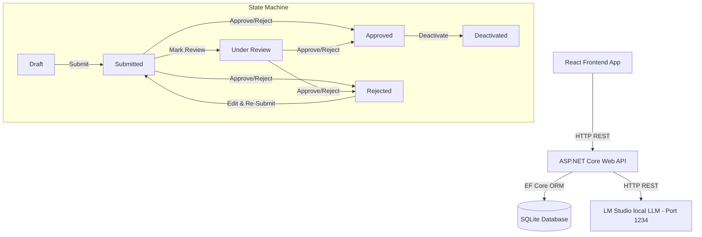

# External Partner Onboarding & Approval Portal

A lightweight, premium web application built for the **Lead Product Manager (AI-Assisted Workflow)** screening assignment at **Dr. Reddy's**. 

This system allows employees to initiate partner onboarding profiles, performs field validation, uses a local Large Language Model (LM Studio) for AI assistance, and enforces a compliance review state machine (Draft → Submitted → Under Review → Approved / Rejected → Deactivated) with full audit trails.

---

## 🚀 Key Features

1. **Compliance Approval Workflow**:
   * **Initiator Role (Employee)**: Creates partner profiles, saves drafts, uses AI-assisted entry helpers, and submits for review.
   * **Approver Role (Reviewer)**: Reviews submitted profiles, shifts state to *Under Review*, enters evaluation comments, and performs *Approve*, *Reject*, or *Deactivate* actions.
2. **AI-Assisted Data Entry**:
   * **AI Category Suggestion**: Analyzes the partner name and organization to suggest three relevant business classification categories.
   * **AI Address Normalization**: Takes raw, unstructured addresses and formats them into structured fields (Street, City, State, Country, ZIP Code).
   * **Local LLM Integration**: Fully compatible with **LM Studio** running the **Gemma 4B** model locally.
   * **Smart Fallback**: If LM Studio is offline, the system gracefully degrades to regex-based static heuristic rules instantly (no loading delays).
3. **Auditability & Traceability**:
   * **Approval History**: Tracks state transitions, comments, and reviewer signatures.
   * **Audit Log**: Records all system-level operations (creates, updates, state changes) for compliance reporting.
4. **Mock API Toggle**:
   * A standalone client-side toggle that runs the entire application using browser `localStorage` for database operations and AI simulation. This allows **instant free hosting on Vercel** to showcase the full prototype without a live backend server.

---

## 🛠️ Tech Stack & Directory Structure

* **Backend**: ASP.NET Core 8 Web API (C#), Entity Framework Core 8, SQLite.
* **Frontend**: React 18, Vite, TypeScript, and Premium Vanilla CSS (custom design system, glassmorphism, responsive grids).
* **Unit Tests**: xUnit, EF Core InMemory, and Moq.

```
partner-approval-portal/
├── backend/                               # ASP.NET Core 8 Web API
│   ├── Controllers/                       # Partners & AI Endpoint Controllers
│   ├── Data/                              # ApplicationDbContext (EF Core & SQLite)
│   ├── DTOs/                              # Input validation DTO annotations
│   ├── Models/                            # Database Entities (Partner, History, AuditLog)
│   ├── Services/                          # Local LM Studio & Fallback Services
│   └── Properties/                        # launchSettings (Port: 5237)
├── backend.Tests/                         # xUnit Test Suite
│   └── PartnerApprovalTests.cs            # Controller & Service Unit Tests
└── frontend/                              # React + TypeScript UI
    ├── src/
    │   ├── App.tsx                        # Main Router & Role Switcher
    │   ├── index.css                      # Custom Design System Variable Styling
    │   ├── mockData.ts                    # LocalStorage API & AI Simulation engine
    │   └── pages/                         # Directory List, Form, & Detail Pages
```

---

## 🏃 Getting Started

### Prerequisites
* [.NET 8.0 SDK](https://dotnet.microsoft.com/en-us/download/dotnet/8.0)
* [Node.js (v18 or higher)](https://nodejs.org/)

---

### Step 1: Run the Backend API

1. Navigate to the backend folder:
   ```bash
   cd backend
   ```
2. Build and run the project:
   ```bash
   dotnet run
   ```
   * The API runs locally on **`http://localhost:5237`**.
   * SQLite will automatically create and migrate the database to `backend/partners.db` on launch.
   * Swagger documentation is available at `http://localhost:5237/swagger`.

---

### Step 2: Run the Frontend UI

1. Open a new terminal window and navigate to the frontend folder:
   ```bash
   cd frontend
   ```
2. Install npm dependencies:
   ```bash
   npm install
   ```
3. Start the Vite development server:
   ```bash
   npm run dev
   ```
   * The React application opens on **`http://localhost:5173`**.

---

### Step 3: Configure Local AI with LM Studio

The application integrates with **LM Studio** to perform local LLM-based category suggestions and address normalization, protecting data privacy.

1. **Download LM Studio**: Install it from [lmstudio.ai](https://lmstudio.ai/) if you haven't already.
2. **Download Gemma Model**: Search for **Gemma** (such as `gemma-2-2b-it` or `Gemma-2-9b-it`) and download a quantized GGUF version (we recommend Gemma 2B/4B/9B depending on your system RAM).
3. **Start Local Inference Server**:
   * Open the **Developer / Local Server** tab in LM Studio (the code icon on the left navigation bar).
   * Select your downloaded **Gemma** model in the top model selection dropdown to load it.
   * Verify the port is set to **`1234`** (our C# backend's default port configuration).
   * Click **Start Server**.
4. **Endpoint Integration**:
   * The backend `AiService.cs` automatically sends requests to the OpenAI-compatible local server endpoint at `http://localhost:1234/v1/chat/completions`.
   * *Graceful Degradation*: If the server is offline or fails to respond within **3 seconds**, the backend automatically triggers local keyword regex stubs to ensure a smooth reviewer experience without freezing the UI.

---

## 🧪 Running Unit Tests

To run the xUnit test suite (which validates controller endpoints, database writes, state transition security rules, and AI fallback behavior):

```bash
dotnet test backend.Tests/PartnerApprovalPortal.Tests.csproj
```

---

## 📐 Architecture & Workflow Design

The system implements a classic **Controller-Service-Repository** pattern with Entity Framework Core serving as the data access layer:



### Transition Security Rules
* Profiles in `Draft` or `Rejected` statuses are editable by Employees.
* Once a profile is `Submitted` or `Under Review`, editing is locked to prevent compliance tampering.
* Only Approved partners can be `Deactivated` (requires deactivation reasons).
* Transition actions write to `ApprovalHistory` (for reviewer commentary) and `AuditLog` (for complete security compliance).

---

## 🤖 AI-Assisted Development Summary

This project was built leveraging the **Antigravity AI Coding Assistant** as a pair programmer:
* **Scaffolding**: Rapidly set up the boilerplate code structure for both React (using Vite) and ASP.NET Core.
* **Migration & Entity Design**: Generated EF Core models, structured database contexts, and tracked database column requirements.
* **State Machine & Logic**: Stubbed out state validation branches inside `PartnersController` to guarantee strict state flow controls.
* **Testing**: Implemented the xUnit test framework and created mock configurations to run in-memory tests.
* **Documentation**: Designed the markdown plans and interactive documentation.
